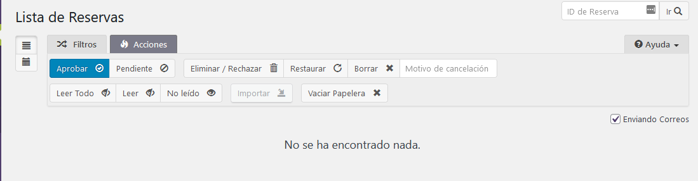
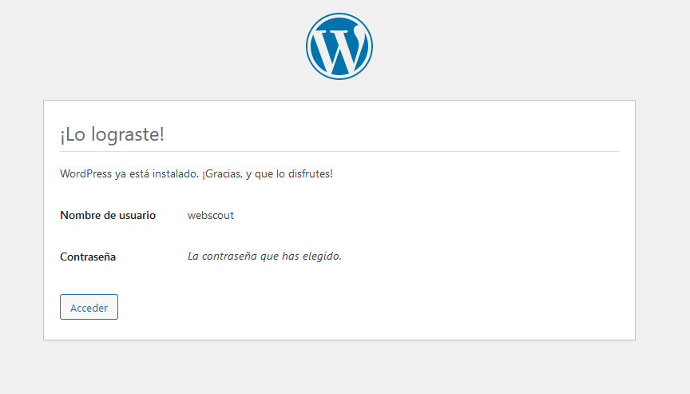

# Página web e Inventario de Grupo Scout

### Grado Superior: Desarrollador de Aplicaciones Web
### Curso: 2020/2021
#### Autor: Pedro Suárez Mula

---

# INDICE

1. Análisis y explicación del Proyecto de Fin de Grado
    1. Introducción y explicación
    2. Objetivo y finalidad del proyecto

2. Planificación previa
    1. Tecnología utilizada para la realización del Proyecto
    2. Desarrollo del programa

3. Problemas y soluciones
    1. Problemas encontrados a la hora de realizar el proyecto.
    2. Soluciones realizadas.

4. Despliegue de aplicación
    1. Tecnología utilizada finalmente para el despliegue del programa final.

5. Conclusión
    1. Revisión de los objetivos previos
    2. Funcionalidad del programa
    3. Finalidad del proyecto

---

## **1. ANÁLISIS Y EXPLICACIÓN DEL PROYECTO DE FIN DE GRADO**
### 1.1. INTRODUCCIÓN Y EXPLICACIÓN DEL PROYECTO

He realizado una página web para el Grupo Scout al que pertenezco, también una aplicación para gestionar el inventario que tiene el grupo y la solicitud y devolución de los materiales.

  ### Página web
  La página web consta de una serie de apartados:

   - Entradas específicas para conocer tanto la historia del escultismo y el movimento cómo la historia del Grupo Scout.
   - Un apartado dónde puedes ver todas las actividades realizadas por el grupo, las futuras actividades a realizar y una breve explicación de lo que hacemos en cada una de ellas.
   - Enlaces para poder acceder a nuestras distintas redes sociales.
   - Tiene un apartado para la gestión de la secretaría del grupo, esta consta de una serie de formularios los cuáles genera unos pdfs con los datos que se le introduce en el formulario. Este apartado es bastante interesante ya que se tiene mayor control de los miembros del grupo. Se puede crear cualquier tipo de formulario y modificando el css de la aplicación podemos cambiar el resultado del pdf.
   - Tiene otro apartado también para la tesorería del grupo (cómo son los datos bancarios para poder pasarle las cuentas), otro que sería para tema de salud (un certificado que indica si tiene o no alguna enfermedad y otro documento el cuál permite a los responsables dar un medicamento en específico).
   - Contará también con un apartado de reservas de la nave del grupo.
   - Tener la posibilidad de crear encuestas y tener registradas las respuestas en las propias actividades o en las noticias.
   - Tener una newsletter actualizada.

  

   ### Inventario del grupo
   El grupo Scout tiene la necesidad de tener un control de todos los materiales con los que cuenta, saber así los materiales que se compran o los que nos ceden, y tener conocimiento de los materiales que se solicitan para las actividades y cuando se devuelven incluyendo así el estado de estos.

   Mi programa está puesto en una página web en Local y consta de 3 aplicaciones en específico:
   - La primera es una aplicación (realizada a código), la cuál escribe un formulario en la web (a través de un shortcode) y los datos recibidos se guardan en una tabla en la base de datos de mysql, la cuál si no está creada la crea por primera vez con el tipo de dato necesario, y después comprueba si ya está creada y de ser así va ingresando los datos en su orden, la cuál servirá para realizar la entrada de los materiales, esta aplicación también dibuja una tabla en el backend de la web a parte de hacerlo en la base de datos de mysql.
   - La segunda es una aplicación, también realizada a código, del mismo estilo que la anterior pero la diferencia es que esta generará un formulario para la solicitud/devolución de los materiales. Generando también una tabla en la base de datos (si no existiese previametne), una tabla en el backend de wordpress.
   - Por último, hacemos uso de la aplicación WpDataTable, la cuál hace una llamada a la base de datos de mysql cogiendo los datos de la tabla que nosotros queramos y así podamos proyectarlo en la página web.

## 1.2. OBJETIVO DEL PROYECTO.

El proyecto tiene diferentes objetivos:

- Realizar una página web para que se conozca quiénes son los Scout, que hacemos, pero sobre todo que se conozca al grupo Scout San Benito.
- Tener un control exhaustivo de la participación de los miembros del grupo en las actividades y así tener el control de las autorizaciones para participar en las actividades.
- Tener un control exhaustivo de los documentos, tanto de los miembros del grupo, cómo tener un control también de las solicitudes de admisión.
- Enseñar que hace el grupo Scout en el día a día, realizando también un enlace a las redes sociales del grupo.
- Tener un control del uso de la nave y así también poder dejar la para alquilar.
- Poder tener un control del inventario del grupo en la web, así también tener el control de los gastos que produce la compra de los materiales.
- Tener un apartado en la web para poder solicitar/devolver un material con el que cuenta el grupo.

Podemos ver dos Entidades/Relaciones claras en el proyecto:

---

## **2. PLANIFICACIÓN PREVIA**

### 2.1 TECNOLOGÍA UTILIZADA PARA LA REALIZACIÓN DEL PROYECTO
Para la realización de este proyecto he utilidado diferentes tecnologías:
- El editor de Visual Studio Core para todos los apartados que consta de edición/creación/modificación de código. Lo he usado especialmente en aplicaciones como:
    - Inventariado, aplicación creada para manejar el inventario del grupo.
    - Solicitud/Devolución creada para tener un registro de los materiales que se solicitan y los que se devuelven, al mismo tiempo tener un poco el control del estado de estos.
    - También para la creación de la documentación que está escrita en .md
    - Configuración del apartado de "Debug_log" para que wordpress muestre todos los errores ahí.

- WordPress para el manejo de la web principal del grupo Scout San Benito. Dentro de este WordPress uso aplicaciones cómo:
    - Administrador de los archivos de WP, que sirve para ver el FTP sin tener que entrar en el panel de control, si no desde el mismo WordPress.
    

    - Editor Tools es un editor de código y un editor en bloque.
    

    - Diferentes aplicaciones de WooCommerce, las usamos para que se generen las autorizaciones y por si en algún momento queremos vender algún producto también estaría configurado ya.
    

    - El conjunto de aplicaciones de Contact Form 7, se usará para crear los formularios.
    

    - ManuSoft aplicación usada para la generación de pdfs en los formularios.
    

    - Diferentes aplicaciones para la optimización de las fotografías cómo son Regenerate Thumbnails, Photonic Gallery, Smush.

    - Una aplicación también muy importante es la Protección de datos de RGPD ya que hay mucho tráfico de documentación por la web.
    
    
    - Aplicaciones también para tener el control de la solicitud de la nave.
    

- Xampp para el funcionamiento de un wordpress local y luego poder hacer la migración una vez creado completo. Para el acceso a la base de datos de MYSQL.
    

- GitHub para la subida de los documentos .md, las aplicaciones de Inventario y Solicitud y para la subida de la aplicación wpDatatable.
- Drive para la suibida de la máquina Virtual con las aplicaciones instaladas, la subida del PowerPoint y documentación solicitada.
- VirtualBox para poder hacer una máquina virtual de Windows y así instalar en esta Xampp para el uso de las diferentes aplicaciones.

---

## **3. PROBLEMAS Y SOLUCIONES**
### 3.1 PROBLEMAS ENCONTRADOS A LA HORA DE REALIZAR EL PROYECTO

A la hora de hacer la página web, me encontré una serie de dificultades, pero las he ido solventando poco a poco, con la instalación de otras aplicaciones:
- Cuando he ido subiendo las entradas y páginas de la web antigua he dejado la fecha y hora con la que se subieron anteriormente.

- A la hora de subir las aplicaciones era muy engorroso hacerlo desde el ftp, para ello encontré la aplicación de "Administrador de archivos WP" que sirve para ver los archivos en el escritorio de WordPress.

- Cuando me dispongo a realizar las páginas y entradas, observo que tiene pocas opciones de edición los textos, por ello instalo "Advanced Editor Tools".

- A la hora de reservar los sitios de la nave al principio lo hacíamos a través del correo, pero era más engorroso por eso encontramos la opción de hacerlo a través de la aplicación "Calendariop de Reservas".

- Al principio los formularios no se guardaban en ningún sitio, pero encontré la opción de guardarlos a través de la extensión "Contact Form CFDB7".

- Antes de empezar a realizar cualquier modificación, instalé la aplicación "Duplicator" por si se perdía algo de la base de datos o de los archivos, esto lo que genera es una copia de seguridad.

- Algunas aplicaciones venían con otro lenguaje y no conseguía entender bien que hacía, para ello decido instalar la aplicación "Loco Translate".

- Para evitar que las imágenes me pesaran tanto en las noticias y en las newsletter encontré la aplicación "Photonic".

A la hora de generar las aplicaciones de Inventario y de Solicitud/Devolución de materiales encontré las siguientes dificultades:

- Encontrar una guía o alguna aplicación para poder realizar lo que tenía en mente, todo lo encontrado no era 
útil o no era lo que necesitaba para la aplicación, pero ya que no encontré nada por internet ni se me ocurría cómo hacerlo, busqué la posibilidad de crear una aplicación con la idea de que hiciese todo lo que yo quisiera.
Adaptar una aplicación pensada para un formulario específico y la entrada de una serie de datos en la base de datos.

 
- A la hora de empezar a crear la aplicación, vi que no era efectivo realizarla en la web que ya tenía montada, ya que no quería modificar ninguna tabla de datos existente, por ello, decido empezar a trabajar en Local para poder meterme sin problemas en la base de datos del wordpress y poder eliminar, crear o editar tablas conforme fuese necesario.

- Al principio fué un poco locura entender que hacía el SQL, el php y los datos que se pedían en los formularios de los ejemplos que encontré, la solución fué ir llamando poco a poco todos los datos en cada una de las consultas para así ir viendo si se creaban bien o no y, sobre todo, ver que tipo de datos estabamos hablando.

- Una vez que la tabla estaba creada en la base de datos, los datos que tenías que pasarle eran exactamente los que pedía, por tanto cada vez que querías hacer una comprobación tenías que crear una nueva tabla, lo que supuso crear unas nuevas bases de datos con sus wordpress correspondientes o crear tablas, al final para poder darme cuenta de los datos que me estaban pidiendo tuve que volver a repasar toda la parte de SQL que dimos en primero, entendiendo así bien cómo se generan las consultas pertinentes, cómo se crea la tabla y cómo se inserta en el array.

-  Dependiendo que datos querías meter en el formulario, se tenía que proyectar de una forma tanto en wordpress cómo en el formulario cómo en la consulta de SQL. Al principio empecé creando tablas dentro de la misma base de datos, pero descubrí que al final seguía chocando una parte de la aplicación, así que decidí crear otras bases de datos. Ahora antes de ejecutar el plugin hay que revisar bien la tabla que se va a crear en la base de datos para no tener ninguna confusión con los datos.

- Para que el usuario metiera los datos correspondientes decidí "sanear las respuestas", para ello tuve que aprender cómo hacerlo a través de php a través de vídeos sobre formularios.

- La fecha de solicitud o devoluición de materiales si se pone bien en el formato de php, al hacer la consulta no se guardaba bien, en cambio, la fecha de creación el inventario si está actuando cómo quiero que actúe, es por esto que decido trabajar la fecha cómo si fuese de tipo texto.

---

## **4. TECNOLOGÍAS FINALES Y DESPLIEGUE DE LA APLICACIÓN**

### 4.1 TECNOLOGÍAS DEL PROGRAMA
Las diferentes tecnologías utilizadas han sido detalladas en el apartado 2.

### 4.2 DESARROLLO DEL PROGRAMA
Empecé desarrollando la página web del grupo con sus diferentes funcionalidades, buscando y modificando las aplicaciones pertinentes para que funcionara tal y cómo tenía pensado en los objetivos.
- Para empezar añadi todas las aplicaciones necesarias para utilizar WooCommerce y las configuré para tener un uso más fluido.
    
    - Utilizando la aplicación "Akaunting para Woocommerce" para así tener la gestión de los clientes, proveedores, facturación fácil y gastos facturables.
    - "Product Customer List for WooCommerce" muestra una lista de los clientes que han comprado el producto en la página de edición.
    - "WC - APG Campo NIF/CIF/NIE" cómo bien indica el nombre es para añadir el campo de NIF/CIF/NIE en los productos.
    - "WC Password Strength Settings" fuerza al usuario a tener una contraseña segura, pudiendo administrar nosotros mismos el nivel que vamos a exigirle al usuario.
    - "WooCommerce Blocks" Genera bloques a la hora de crear los productos, una forma más fácil y segura de poder crear el producto tal y cómo queremos.
    - "WooCommerce Menu Cart" genera un botón en la web para poder ir al carrito directamente.
    - "WooCommerce Order Signature" genera un campo de firma para que el administrador pueda ver la firma del usuario.
    - "WooCommerce PDF Invoices & Packing Slips" crea, imprime y envía por correo electrónico las facturas en pdf.
    - "WooCommerce Redsys Gateway Light" usa la pasarela de Redsys para hacer los pacos.
    - "WooCommerce Shortcodes" genera shortcodes de los productos para poder ponerlo en otras páginas webs.
    - "WooEvents" hacemos que woocommerce se conecte con el calendario y pueda proyectar en este las actividades.

- Después cómo una de las ideas es el contacto con los usuarios, utilicé la aplicación Anti-Spam ya que iba a adjuntar una serie de formularios que trabajan a través del correo y así no entraba ningún correo basura.
    

- Añadí varias aplicaciones de formulario cómo son "Contact Form".
    - "Contact Form 7" Crea formularios de contacto.
    
    - "Contact Form 7 Signature Addon" Crea un campo de firma para el la aplicación anterior.
    - "Contact Form CFDB7" Guarda y gestiona los mensajes de "Contact Form 7", así no se pierden los datos.
    

- Para el envío de las newsletter he utilizado una aplicación llamad MailPoet 3, la cuál crea y envia boletines, publica notificaciones y más apartado que són fáciles de configurar.
    

- Uso la aplicación ManuSoft creada para convertir los registros de la aplicación "Contact Form 7" a pdf, así podremos generar cualquier formulario y exportar en pdf el resultado.

Para poder realizar las aplicaciones de Inventario y de Solicitud/Devolución de materiales, creé un wordpress en Local a través de xampp, y una base de datos de mysql para poder guardar todos los datos de la web.
1. Lo primero que tenemos que hacer es crear una base de datos en nuestro xampp.
    

2. Subimos los archivos de WordPress a una carpeta que debe de estar en C:/xampp/htdocs/"nombreweb"
    
    

3. Después iremos a nuestro navegador y pondremos: localhost/"nombreweb", e iremos poniendo los datos que nos van solicitando.
    
    

Después me centré sobre todo en la aplicación del Inventario ya que era algo más específico y más complicado de conseguir. 
Esta aplicación consta de varias partes:

1. A la hora de crear una aplicación para WordPress es importante poner el apartado de **Plugin Name**, **Author** y **Description** tal cuál, ya que sirve para la documentación previa que se verá en el apartado de *Plugins* en nuestro WordPress, explicando el nombre, el autor y una breve descripción de lo que hace nuestra aplicación. Se le puede añadir más apartado cómo la versión de la aplicación.

2. Llamamos a uno de los hook de wordpress, para ello usamos la función **register_activation_hook**, la cuál necesita dos parametros, el primero es *$file:string* que usará el fichero principal de nuestro Aplicación, para indicarle la ruta del fichero usamos la variable de php __FILE__ que nos va a devolver la ruta del fichero que estamos actualmente, *$function:callable* que llamará a la función que le indiquemos que use.

3. Invocamos una variable global de wordpress **$wpdb** a la cuál se le harán las consultas en SQL, para ello primero creamos el nombre de la tabla y para ello usamos la función **$nombreTabla = $wpdb->prefix . "concatenando el nombre que queramos añadirle"** esto tiene cómo resultado *wp_inventario*. Es importante es utilizar el mismo orden que estamos usando en la base de datos, cómo esto puede variar dependiendo del usuario utilizaremos una función de php que nos lo ordena **$charset_collate = $wpdb->get_charset_collate()** y por último escribimos nuestra consulta de SQL.

4. Para crear la consulta usamos la función **$query ="CREATE TABLE IF NOT EXISTS $nombreTabla"**. Y creamos la consulta cómo se puede ver en el "*inventariado.php*". Por último, una vez cerrada la consulta le volvemos a poner la variable **$charset_collate** para indicarle el orden en el que queremos los datos. Para finalizar vamos a lanzar esta consulta para que se cree la tabla, para ello nos hace falta una función que se llama *dbDelta($query)* pero para asegurarnos de que esté disponible tenemos que poner la función de WordPress **include_once ABSPATH . 'wp-admin/includes/upgrade.php'** esto hace que llame de forma seguro a la función **dbDelta**.
 
5. Para comprobar que la consulta está bien creada y no nos hemos equivocado escribimos las funciones de debug, en nuestro fichero *wp-config.php*, para hacerlo primero activamos las funciones de debug de wordpress:
    >- Tenemos que definir una constante **define('WP_DEBUG', true)**, así WordPress sabrá que que queremos activar dicha función.
    >- Luego ponemos la función **define('WP_DEBUG_DISPLAY', false)**, para que no se pinten los errores en la pantalla de WordPress, ya que de ser así podría volver un poco loco a aquellas personas que no tengan conocimiento del código y vean nada más que los errores.
    >- Para nosotros poder ver dichos errores usamos la función **define('WP_DEBUG_LOG', true)** que enviará los errores a un fichero, el cuál se encuentra en la ruta por defecto del fichero de log, que se encuentra en /wp-content/debug.log

6. En caso de que falle la consulta, podríamos ir a mysql, generarla directamente en el SQL y así sabremos que fallos nos estaría dando.

7. Una vez creada la tabla, haremos que se guarde en ella los datos de los formularios, para ello lo primero es saber si los datos están rellenos. Para ello usamos un *if()*, si vienen rellenos utilizaremos la clase de WordPress **global $wpdb**y el método **$wpdb->insert($nombreTabla, ...)** para poder insertar los datos en nuestra tabla. Comprobamos que los datos no vengan vacíos, y cómo es un formulario también saneamos las respuestas de los usuarios convirtiendo los datos que nos vengan en el formato que nosotros habíamos solicitado.

8. Definimos el shortcode que pinta el formulario, par ello usamos la función **add_shortcode**, la cuál tiene un *$tag:string* el cuál será el resultado de nuestro shortcode, y una función *&callback:callable*, que se usará para llamar a la función que queremos que genere nuestro shortcode.

9. Empezamos a escribir la función dónde se encuentra nuestro formulario, para ello en vez de hacerla mediante echo o print, vamos a usar una función de php que abre un flujo de salida en html y luego lo cierra y al cerrarlo demuestra el html que hayamos escrito, esta función se llama **ob_start()** y después ponemos **return ob_get_clean()** para que nos lo devuelva limpio. Tenemos que cerrar y abrir el *<?php ?" ">* cada vez que sea necesario para que así funcione bien nuestro formulario.

10. Vamos a escribir nuestro formulario con un *method="post"* y ponemos una clase para después editar el css y muy importante poner un action par que cuando alguien envíe el formulario le indiquemos que queremos que devuelva la misma página, para ello ponemos un enlace permanente con una función de php, **get_the_permalink()**. Después empezamos a escribir nuestro formulario con html.

11. Añadimos la función de wordpress **wp_enqueue_style('css_aspirante', plugins_url('fichero.css'__FILE__)**, el cuál nos cogerá el archivo css, de la carpeta dónde se encuentra nuestro plugin y lo usará cómo hoja de estilo para nuestro formulario. Esta es una función php por eso tiene que estar antes del **ob_start()**.

12. La función *wp_nonce_field('graba_inventario', 'inventario_nonce')* de php crea unos campos ocultos en el formulario con un tokken para verificar la validez del formulario. 

13. Para crear la página de administración de nuestra aplicación en WordPress usamos la función **add_action** *("admin_menu", "NombreFuncion")*, después desarrollamos la función. Esta función debe añadir una página de menú, para esto usamos la función **add_menu_page** *("Nombre que tenga el panel de administración", "Texto que aparece en el menú izquierdo", "nivel de privilegios", "slug" , "función encargada de pintar en el panel de administración", "url con icono, o dachicons de wordpress", numero para localización del menú)*

14. Se define la función comentada anteriormente, esta imprimirá el código html que necesitamos para pintar una tabla dónde entrarán todos los registros, realizar una consulta SQL para mostrar todos los registros que se han grabado y recorrer con un bucle los registros para irlos mostrando y después pues ya cerrar el html. Volvemos a usar la variable de **global $wpdb** cómo siempre hacemos cuando trabajamos con la base de datos, preparamos una variable que me va a almacenar el nombre de la tabla dónde hemos ido guardando los registros **$nombreTabla = $wpdb->prefix . 'tabla'**, realizamos la consulta con una variable nueva a la base de datos *$variable = $wpdb->get_resutls("SELECT * FROM $nombreTabla")*, después empezamos a crear el panel de administración con diferentes *echo* y por último creamos un *foreach($variable as $tabla*), para hacer el bucle dependiendo de los datos que se generan en el formulario tendremos que usar *esc_textarea* si es tipo texto o *(int)* si es tipo número, cerramos el bucle dibujando el cierre de la tabla.

Una vez finalizado el Inventario, me centré en Solicitud/Devolución ya que, una vez conseguido el inventario, este tenía un poco la misma dinámica, pero con datos diferentes. 

- Esta aplicación consta de las mismas partes que la aplicación de *Inventariado*, pero con algunas diferencias:
    - Los datos que genera la tabla son más.
    - El sufijo de la tabla tiene que ser diferente para que genere otra.
    - Al sanear todos los datos hay que tener los diferentes tipos de datos que vamos a pedir en el formulario.
    - A la hora de presentar la aplicación en WordPress cambiamos el "dashicons" para que haya diferencia con respecto a los demás.
    - Cuando generamos la tabla en WordPress tenemos que tener cuidado también a la hora de proyectarlos ya que hay muchos datos diferentes. 

- Por último para que nuestra web tenga un estilo más preciso, en el personalizador de Temas añadimos los siguientes datos de css: 
> .wpDataTablesWrapper .dataTables_info { display: none; }

> .wpdt-c .wpDataTables .wpDataTablesWrapper{ margin-left: -300px; margin-right_ -300px; }

> form.cuestionario label { font-size:20px; }

---

## **5. CONCLUSIÓN**
### 5.1. REVISIÓN DE LOS OBJETIVOS PREVIOS
- Realizar una página web para que se conozca quiénes son los Scout, que hacemos, pero sobre todo que se conozca al grupo Scout de San Benito, este objetivo ha sido cumplido en su totalidad.

- Tener un control exhaustivo de la participación de los miembros del grupo en las actividades y así tener el control de las autorizaciones para participar en las actividades, este objetivo ha sido conseguido a través de la utilización de WooCommerce y las diferentes aplicaciones.

- Tener un control exhaustivo de los documentos, tanto de los miembros del grupo, cómo tener un control también de las solicitudes de admisión, este objetivo ha sido conseguido gracias a la utilización de aplicaciones de ContactForm y ManuSoft.

- Enseñar que hace el grupo Scout en el día a día, realizando también un enlace a las redes sociales del grupo, este objetivo ha sido cumplido en su totalidad.

- Tener un control del uso de la nave y así también poder dejarla para alquilar, este objetivo ha sido cumplido gracias a la aplicación de "Calendario de Reservas"

- Poder tener un control del inventario del grupo en la web, así también tener el control de los gastos que produce la compra de los materiales, este objetio ha sido cumplido gracias a la aplicación creada en Local.

- Tener un apartado en la web para poder solicitar/devolver un material con el que cuenta el grupo, este objetivo ha sido cumplido correctamente para la versión 1, para la versión 2 hay mejoras pensadas. 

### 5.2 FUNCIONALIDAD DEL PROGRAMA
La web de scoutsanbenito.es está funcionando cómo se había planteado, con todas las aplicaciones actualizadas y al día, con el control exhaustivo de las actividades, de los papeles, dá conocimiento de lo que es el grupo y de lo que es el movimiento scout. 
Es una página web que ya está en funcionamiento, la gente puede entrar y solicitar admisión en el grupo scout, al mismo tiempo que puede ver las activiades que hacemos, pero no puede participar en ellas hasta que no sean miembros del grupo.

Con respecto a las otras aplicaciones que están en local:
- En el Inventario podemos ir introduciendo los materiales para poder tener una lista de ellos y, sobre todo, poder tenerlo bien organizado en la web, para poder proyectar los datos de la base de datos que estamos utilizando usamos la aplicación wpDatatables.

- El formulario de Solicitud de materiales también está en funcionamiento, sirve para tener un control claro de la fecha que se va a solicitar, quién lo solicita, que tipo de material y desde dónde lo va a solicitar (tipo de rama), esto también se proyectará en la web, pero solo lo podrán ver aquellos usuarios que nosotros permitamos (permitiendolo con los roles de WordPress).

- Esta es la versión 1, en un futuro se realizará a la versión 2, la cuál contará con mejores y con la migración de la aplicación a nuestra web Scout

### 5.3 FINALIDAD DEL PROYECTO
Mi proyecto estaba reflejado en hacer la vida más fácil al grupo tanto en la parte de gestión personal (datos, fichas médicas, cuentas bancarias, redes sociales, autorizaciones...), cómo para la gestión de los materiales que se tenía, cómo la solicitud/devolución de estos, tener conocimiento también si había que reponerlos, quién los había cogido... 

Es una aplicación que llevamos bastante tiempo darle una vuelta y he aprovechado que se necesitaba algo así cómo para poder crearlo y darle una utilidad real.

## **6. BIBLIOGRAFÍA**

1. https://diego.com.es/formularios-en-php
2. https://developer.wordpress.org/resource/dashicons/#dismiss
3. https://kungfupress.com/como-programar-un-formulario-en-wordpress-sin-utilizar-plugins/
4. Una serie de vídeos cómo:
    - https://www.youtube.com/watch?v=4TF16H5M7OI
    - https://www.youtube.com/watch?v=J2yGET3ojZk
    - https://www.youtube.com/watch?v=yrMyicSY6Lo&t=13s
5. https://kungfupress.com/
6. https://github.com/kungfupress/kfp_formulario_aspirantes

